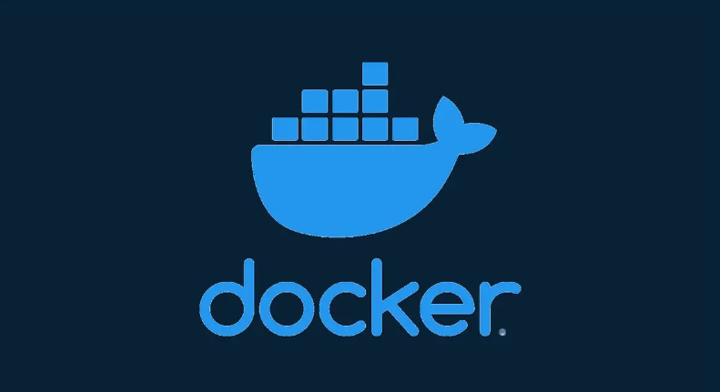

# Ejercicios Docker

**Batería de ejercicios sobre la gestión de contenedores Docker realizadas en la asignatura de Despliegue de aplicaciones WEB.**

[1º Parte - Docker básico](/docker_basico/readme.md)

  

[2º Parte - Docker imágenes](/docker_imagenes/readme.md)

  

[3º Parte - Docker almacenamiento](/docker_amacenamiento/readme.md)

Trabajos realizados por **Javier Viesca Tuñón**

