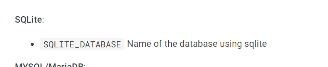

# TAREA DOCKER

### 1.**Instala docker en una máquina y configúralo para que se pueda usar con un usuario sin privilegios.**

Si queremos usar el cliente de docker con un usuario sin privilegios, usaremos el comando:

`usermod install docker.io`

### 2.**Ejecuta un contenedor a partir de la imagen hello-word.**

Primero ejecutamos la imagen hello-world ejecutando el comando de docker:

`docker run hello-world`

### **Comprueba que nos devuelve la salida adecuada.**

### 

### **Comprueba que no se está ejecutando.**

Para comprobar que contenedores se están ejecutando, usamos el comando:

 `docker ps`

### Lista los contenedores que están parados.

`docker ps - a`

### Borra el contenedor.

`docker rm amazing_euclid`

### 3.Crea un contenedor interactivo desde una imagen debian. 

`docker run -it deban bash`

### Instala un paquete (por ejemplo nano ). 

Para instalar un paquete, primero actualizamos la base de repositorios de linux:

`apt-get update`

Después instalamos el paquete nano:

`apt-get install nano`

### Sal de la terminal, ¿sigue el contenedor corriendo? ¿Por qué?. 

El contenedor no está corriendo. ya que no lo hemos arrancado como demonio.

### Vuelve a iniciar el contenedor y accede de nuevo a él de forma interactiva. ¿Sigue instalado el nano ?. 

Nano sigue instalado en el contenedor, ya que se guardan los datos de la imagen.

### Sal del contenedor, y bórralo. Crea un nuevo contenedor interactivo desde la misma imagen. ¿Tiene el nano instalado?

Creamos un nuevo contenedor interactivo usando la id de la imagen que ya tenemos en local, cuando intentamos ejecutar nano, no existe. 

Es una imagen nueva por lo que todos los datos que teníamos antes, se pierden.

### 4.Crea un contenedor demonio con un servidor nginx, usando la imagen oficial de nginx. Al crear el contenedor, ¿has tenido que indicar algún comando para que lo ejecute?

Creamos el contenedor con el comando *-d*. Este comando hace que NGINX se esté ejecutando en segundo plano. Usamos también el comando *--name* para indicarle un nombre al contenedor.

`docker run -d --name miNginx nginx`

### Accede al navegador web y comprueba que el servidor esta funcionando. 

Usamos el comando inspect para saber la ip y el puerto:

`docker inspect miNginx`

Desde el navegador entramos en la dirección ip que nos indica:

### Muestra los logs del contenedor.

Para ello usamos el comando logs:

`docker logs miNginx`

### 5.Crea un contenedor con la aplicación Nextcloud, mirando la documentación en docker Hub, para personalizar el nombre de la base de datos SQLite que va a utilizar.

Nos vamos a la página https://hub.docker.com/_/nextcloud, donde encontraremos toda la documentación. Encontramos que para darle un nombre a nuestra BBDD SQLite, tendremos que incluir esta variable de entorno:

`docker run -d --name myNextCloud -e SQLITE_DATABASE=javibbdd nextcloud`