# Docker Almacenamiento

[TOC]

## Volúmenes Docker

### 1.Crea un volumen docker que se llame miweb . 

`docker volume create miweb`

### 2.Crea un contenedor desde la imagen php:7.4-apache donde montes en el directorio /var/www/html (que sabemos que es el DocumentRoot del servidor que nos ofrece esa imagen) el volumen docker que has creado. 

`docker run -d --name myApache --mount type=volume,src=miweb,dst=/var/www/html -p 8080:80 php:7.4-apache`

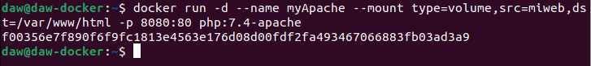

### 3.Utiliza el comando docker cp para copiar un fichero index.html en el directorio /var/www/html . 

`docker cp index.html myApache:/var/www/html`

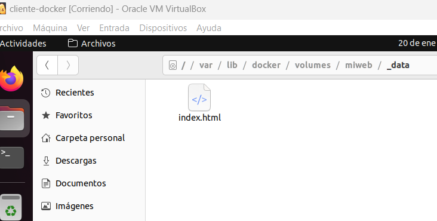

### 4.Accede al contenedor desde el navegador para ver la información ofrecida por el fichero index.html . 

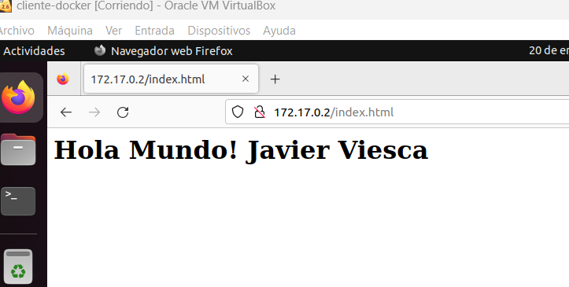

### 5.Borra el contenedor.

Borramos el contenedor: 

`docker rm -f myApache`

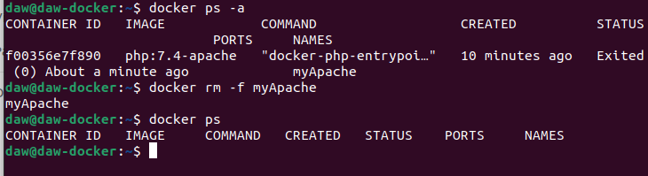

### 6.Crea un nuevo contenedor y monta el mismo volumen como en el ejercicio anterior. 

Volvemos a crear el mismo contenedor que en el ejercicio 2. Por lo que usamos el mismo comando:

`docker run -d --name myApache --mount type=volume,src=miweb,dst=/var/www/html -p 8080:80 php:7.4-apache`

### 7.Accede al contenedor desde el navegador para ver la información ofrecida por el fichero index.html . ¿Seguía existiendo ese fichero? 

Al acceder al servidor observamos que el fichero index.html sigue activo, ya que el archivo esta alojado en nuestro volumen local `miweb`.

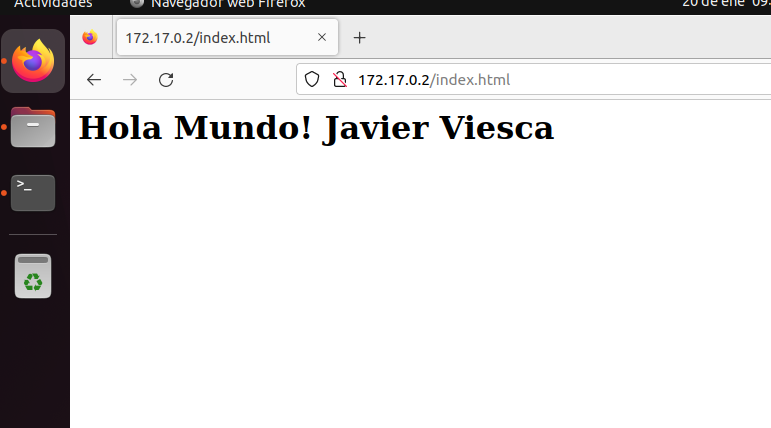

## Bind Mount

### 1.Crea un directorio en tu host y dentro crea un fichero index.html . 

Creamos la carpeta myApp y dentro un archivo index.html.

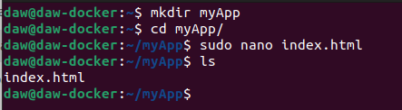

### 2.Crea un contenedor desde la imagen php:7.4-apache donde montes en el directorio /var/www/html el directorio que has creado por medio de bind mount . 

`docker run -d --name myAppBind -v /home/daw/myApp:/var/www/html -p 8080:80 php:7.4-apache`

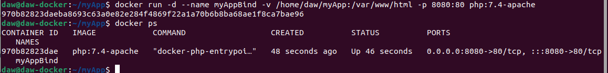

### 3.Accede al contenedor desde el navegador para ver la información ofrecida por el fichero index.html .

 Accedemos a la dirección ip del servidor y visualizamos el archivo.

### 4.Modifica el contenido del fichero index.html en tu host y comprueba que al refrescar la página ofrecida por el contenedor, el contenido ha cambiado. 

Modificamos el index.html desde la carpeta local:

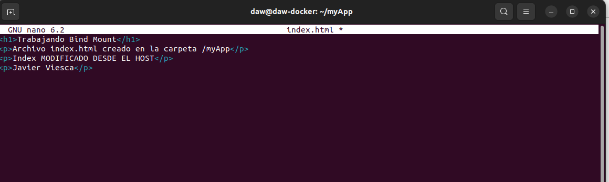

Al acceder al servidor, vemos que el contenido ha cambiado:

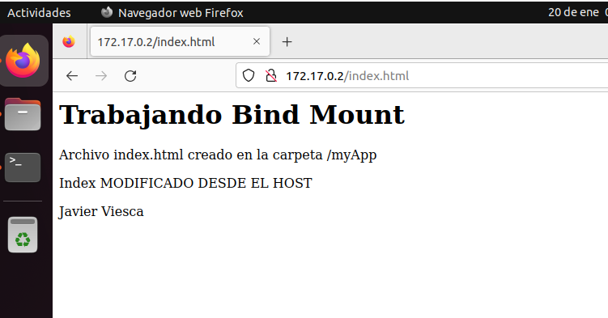

### 5.Borra el contenedor 

Eliminamos el contenedor:

`docker rm -f myAppBind`

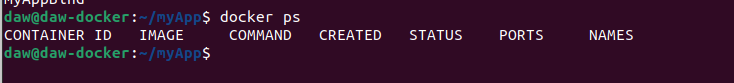

### 6.Crea un nuevo contenedor y monta el mismo directorio como en el ejercicio anterior. 

Volvemos a crear el mismo contenedor que en el ejercicio anterior:

`docker run -d --name myAppBind -v /home/daw/myApp:/var/www/html -p 8080:80 php:7.4-apache`

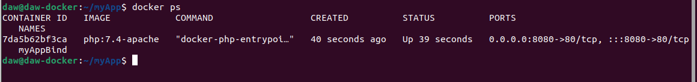

### 7.Accede al contenedor desde el navegador para ver la información ofrecida por el fichero index.html . ¿Se sigue viendo el mismo contenido?

Al acceder al servidor vemos que se sigue viendo el mismo contenido, el servidor sigue leyendo los datos de nuestro host:

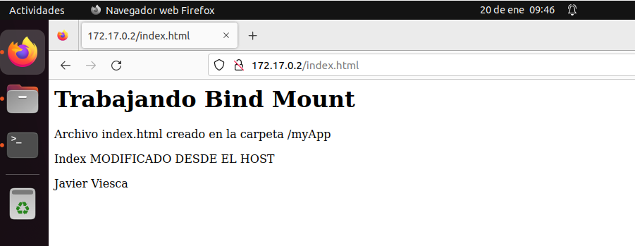