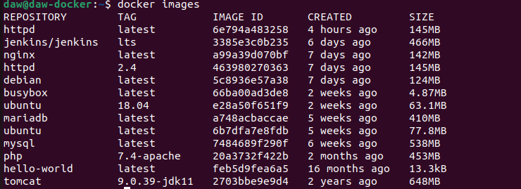
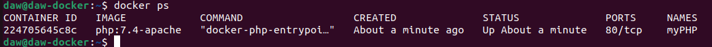
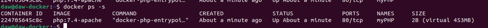
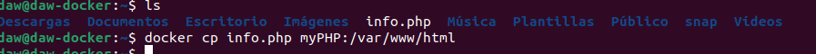
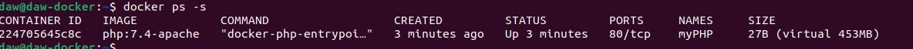
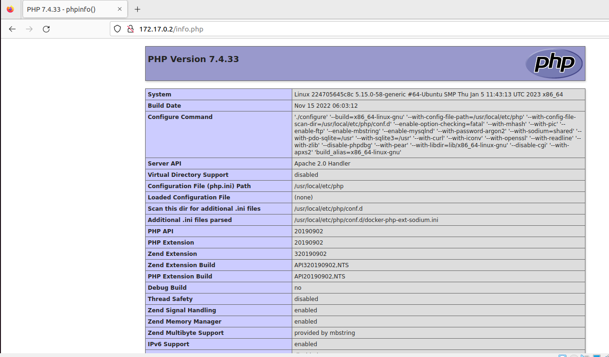

# Practicas Docker. Imágenes.

#### 1. Descarga las siguientes imágenes: `ubuntu:18.04 , httpd , tomcat:9.0.39-jdk11 , jenkins/jenkins:lts , php:7.4-apache `.

Descargamos todas las imágenes con el comando pull:

`docker pull ubuntu:18.04`

`docker pull httpd`

...

#### 2.Muestras las imágenes que tienes descargadas. 

Con el comando: `docker images` mostramos las imágenes

#### 3.Crea un contenedor demonio con la imagen php:7.4-apache . 

Creamos el contenedor:

`docker run -d --name myPHP php:7.4-apache` 

#### 4.Comprueba el tamaño del contenedor en el disco duro. 

`docker ps -s`

#### 5.Con la instrucción docker cp podemos copiar ficheros a o desde un contenedor. Puedes encontrar información es esta [página](https://docs.docker.com/engine/reference/commandline/cp/). 

#### Crea un fichero en tu ordenador, con el siguiente contenido: 

`<?php
echo phpinfo();
?>`

#### Copia un fichero info.php al directorio /var/www/html del contenedor con docker cp. 

`docker cp info.php myPHP:/var/www/html`

#### 6.Vuelve a comprobar el espacio ocupado por el contenedor. 

`docker ps -s`

#### 7.Accede al fichero info.php desde un navegador web.

Accedemos desde el navegador a la ruta `172.17.0.2/info.php`

