# Ejercicios 


## Trabajar con redes docker 


#### 1.Vamos a crear dos redes de ese tipo (BRIDGE) con los siguientes datos: 

- Red1 
  - Nombre: red1 
  - Dirección de red: 172.28.0.0 
  - Máscara de red: 255.255.0.0 
  - Gateway: 172.28.0.1 
- Red2 
  - Nombre: red2 
  - Es resto de los datos será proporcionados automáticamente por Docker.

Creamos las 2 redes con los datos del ejercicio:

```bash
docker network create -d bridge --subnet 172.28.0.0/16 --gateway 172.28.0.1 red1
```

```
docker network create -d bridge red2
```

Hacemos un docker `network inspect` para ver la información de las redes:

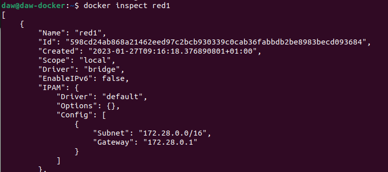

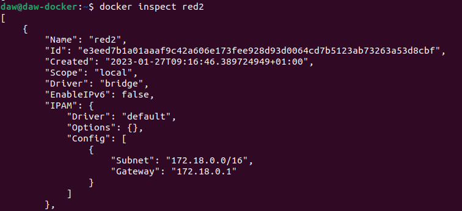


#### 2.Poner en ejecución un contenedor de la imagen `ubuntu:20.04` que tenga como hostname `host1` , como IP `172.28.0.10` y que esté conectado a la red1. Lo llamaremos `u1`. 

Arrancamos el contenedor con los datos solicitados:

```
docker run -it --name u1 --network red1 --hostname host1 --ip 172.28.0.10 ubuntu:20.04
```


#### 3.Entrar en ese contenedor e instalar la aplicación ping ( `apt update && apt install inetutils-ping` ). 

Instalamos las inetutils para poder usar el comando ping:

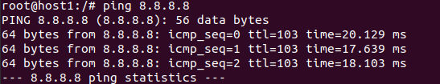


#### 4.Poner en ejecución un contenedor de la imagen `ubuntu:20.04` que tenga como hostname `host2` y que esté conectado a la red2. En este caso será docker el que le de una IP correspondiente a esa red. Lo llamaremos `u2` . 

Arrancamos 2º contenedor:

```
docker run -it --name u2 --network red2 --hostname host2 ubuntu:20.04
```


#### 5.Entrar en ese contenedor e instalar la aplicación ping ( `apt update && apt install inetutils-ping` ). 

Instalamos inetutils en el 2º contenedor y comprobamos que funciona:

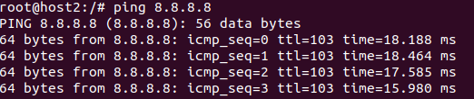


El documento debe contener, además, los siguientes pantallazos: 

- Pantallazo donde se vea la configuración de red del contenedor u1. 

  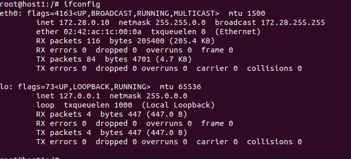

- Pantallazo donde se vea la configuración de red del contenedor u2.

  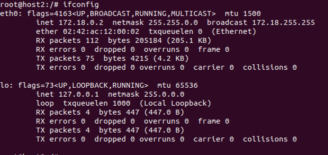

- Pantallazo donde desde cualquiera de los dos contenedores se pueda ver que no podemos hacer ping al otro ni por ip ni por nombre. 

  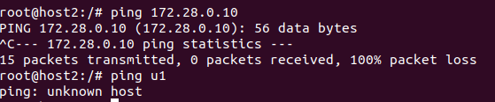

- Pantallazo donde se pueda comprobar que si conectamos el contenedor u1 a la red2 (con docker network connect ), desde el contenedor u1, tenemos acceso al contenedor u2 mediante ping, tanto por nombre como por ip. 

  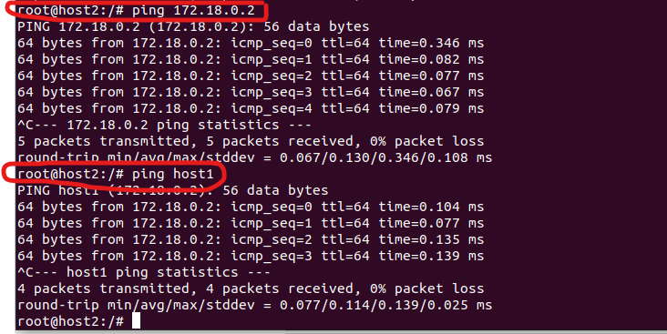


## Despliegue de Nextcloud + mariadb/postgreSQL 

Vamos a desplegar la aplicación nextcloud con una base de datos (puedes elegir mariadb o PostgreSQL) (**NOTA: Para que no te de errores utiliza la imagen `mariadb:10.5`** ). Te puede servir el ejercicio que hemos realizado para desplegar **Wordpress.** Para ello sigue los siguientes pasos: 

#### 1.Crea una red de tipo bridge.

 Creamos la red:

```
docker network create -d bridge red1
```

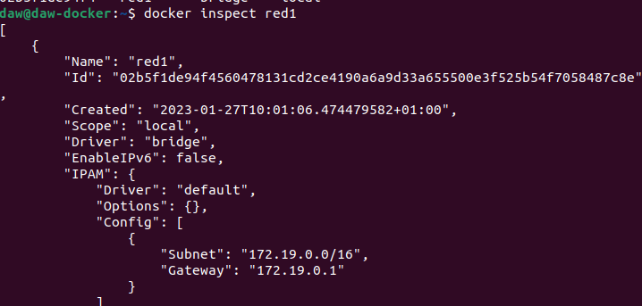


#### 2.Crea el contenedor de la base de datos conectado a la red que has creado. La base de datos se debe configurar para crear una base de dato y un usuario. Además el contenedor debe utilizar almacenamiento (volúmenes o bind mount) para guardar la información. Puedes seguir la documentación de mariadb o la de PostgreSQL. 

```
docker run -d --name myMariadb --network red1 -v /opt/mysql_javi:/var/lib/mysql -e MYSQL_DATABASE=cosas -e MYSQL_USER=javi -e MYSQL_PASSWORD=temporal -e MYSQL_ROOT_PASSWORD=temporal mariad
```

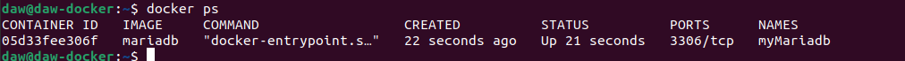

#### 3.A continuación, siguiendo la documentación de la imagen nextcloud, crea un contenedor conectado a la misma red, e indica las variables adecuadas para que se configure de forma adecuada y realice la conexión a la base de datos. El contenedor también debe ser persistente usando almacenamiento. 

```
docker run -d --name myNextCloud -p 8080:80 --network red1 -v nextcloud:/var/www/html nextcloud
```

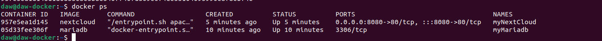

#### 4.Accede a la aplicación usando un navegador web. 

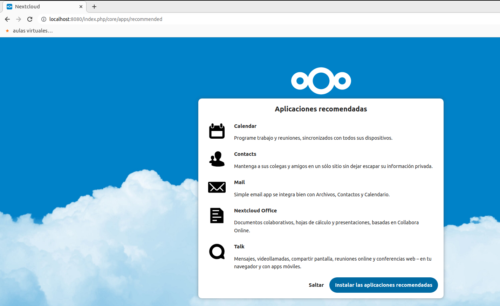

El documento debe contener, además, los siguientes pantallazos: 

- Pantallazo con la instrucción para crear el contenedor de la base de datos. 
- Pantallazo con la instrucción para crear el contenedor de la aplicación. 
- Pantallazo donde se ve el acceso a la aplicación desde un navegador web.